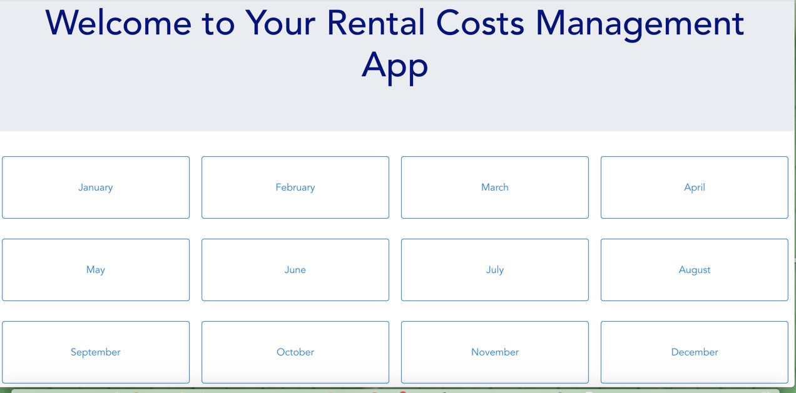
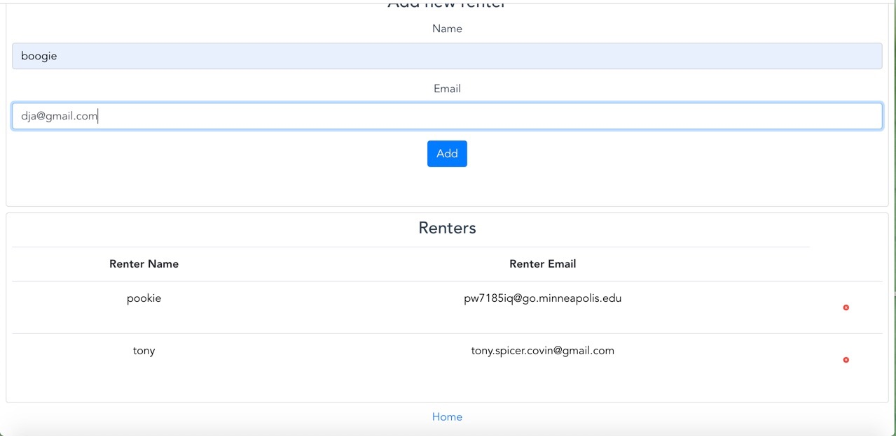
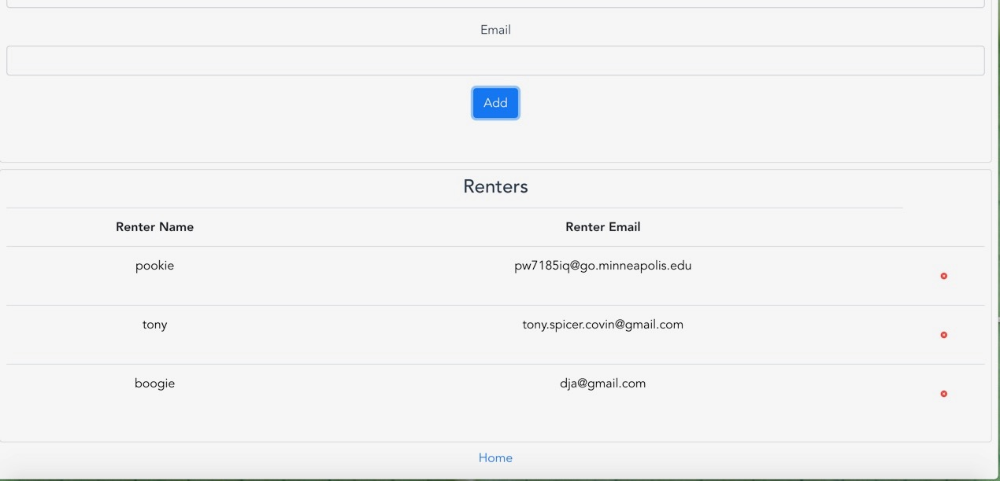
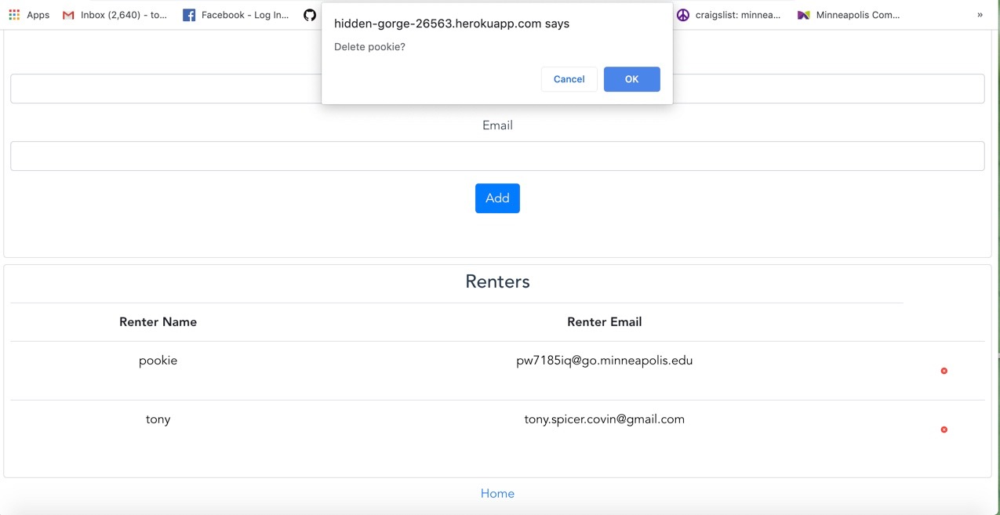
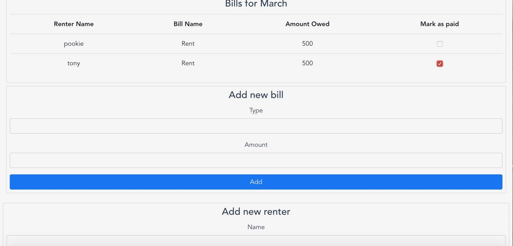

# Rental Costs Management App
This is a vue app with an express server using API calls.
There are three tables in the database. Users, Bills and RenterPortions.
Users are stored with attributes name and email, bills have name, amount and month.
When you add a new bill my application splits that bill based on how many users there are and adds a portion into
the renterPortions table. That table has attributes billID, renterID, renter name, amount owed, the month, and whether it's paid or not. By selecting the paid checkbox it changes the paid value to true.

 
 
 
 
 